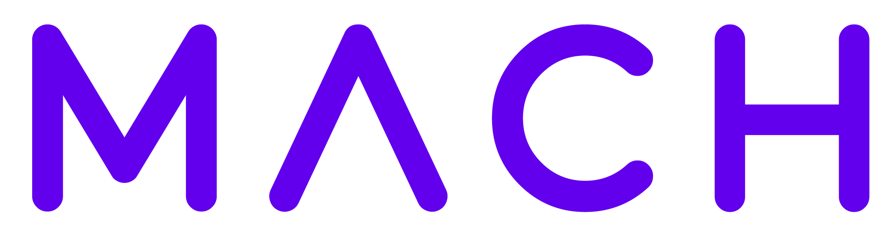
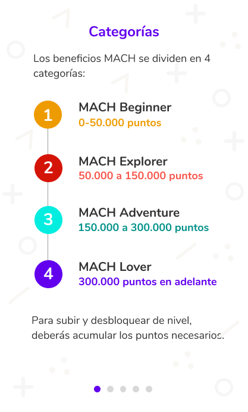
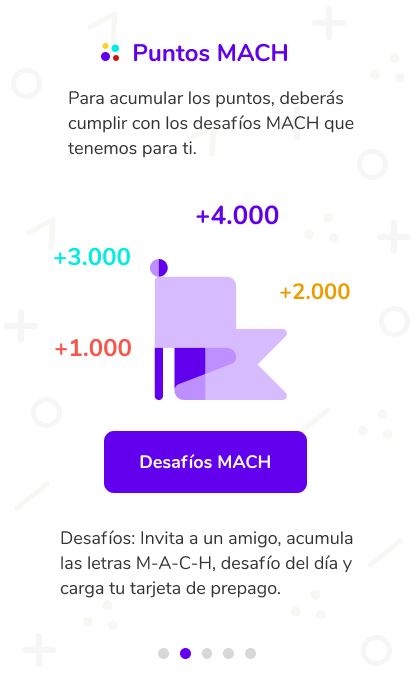
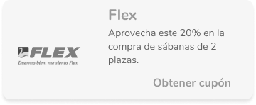
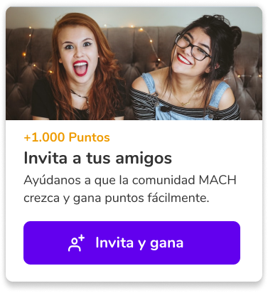
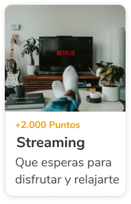

 
# MACH- HACKATHON GENERACIÓN 014SCL LABORATORIA 

MACH es una de las Fintech líder del mercado, la cual busca democratizar el acceso a productos bancarios para todos.  Con más de 2 millones de usuarios registrados desde su inicio, MACH siempre tiene como objetivo la búsqueda de poder mejorar la experiencia de ellos y seguir creando una comunidad. 
## DESAFIO 

En atención a ello el desafío propuesto por MACH fue el siguiente: 
_“Nos encanta premiar la lealtad de nuestros usuarios con beneficios _exclusivos por ser #MACHLovers de corazón.
_Hoy nuestros usuarios tienen dificultades para ver sus beneficios, ver a _qué categorías pertenecen y poder usar los puntos que va acumulando en la _medida que va comprando en MACH (gamification).
_Soñamos con una solución tecnológica que viva en un entorno web y que _posteriormente podríamos incluir dentro de la App.”

## PLAN DE TRABAJO

Se realizó un plan de trabajo en el cual tanto el proceso UX como el proceso de Front-End pudiera estar a la par. En el trabajo UX se realizaron análisis benchmark, entrevistas con usuarios y stakeholder, lluvias de ideas, creación de prototipo de alta fidelidad, testeo de prototipo de alta fidelidad e iteraciones finales. 
Mientras que el plan de trabajo Front-End consistió en estudio de tecnologías y librerías que se pudieran utilizar en la maquetación, creación de ambiente de trabajo, análisis de prototipo y determinación de componentes reutilizables, trabajo en código de pantallas y componentes. 

## DESCUBRIMIENTOS

En relación con todo el proceso de plan de trabajo mencionado, es que llegamos al siguiente descubrimiento respecto al desafío propuesto por MACH: 
_“Los beneficios que ofrece MACH hoy no son atractivos para los usuarios. _Ellos preferirían obtener beneficios que se ajusten a sus intereses o _hobbies y verlos incluidos en la dentro de la App, ya que no navegan en _la página web de MACH”

Además que la solución propuesta debe cumplir con los siguientes elementos: 

-	Diseñada para la aplicación, en atención a que para los usuarios es más fácil y amigable tener dicha información en un solo lugar. 
-	Beneficios deben ser atractivos para los usuarios. 
-	Beneficios deben considerar los intereses y hobbies de cada persona. 

## SOLUCIÓN

Nuestra solución se basa en 4 pilares: 

1)	Walkthrough bienvenida: 
Para los usuarios nuevos de MACH se va a desplegar un tutorial en el cual se les explicara el sistema de puntos, como obtener puntos, los beneficios y desafíos que existen. 

 
 

2)	 Puntos MACH: 
Creamos un sistema de puntajes y categorías en los cuales cada cierto rango los usuarios van a tener acceso a distintos beneficios(descuentos) y canjes de puntos en comercios asociados.

 

3)	Sistema de beneficios
El usuario va a poder acceder a beneficios de forma progresiva, acorde a su categoría de Puntos MACH, además va a poder filtrar los beneficios según sus intereses y hobbies. Y en el caso que no quiera utilizar un beneficio, va a poder regalarlo a otro usuario. 

4)	Desafíos MACH:
Para incentivar a los usuarios a usar MACH y a seguir avanzando de categorías, establecimos distintos desafíos con los cuales van a poder juntar puntos. Entre ellos se encuentran desafíos de “Paga con MACH”, que es el pago de servicios y productos; y también existen desafíos para aumentar la comunidad como lo es “Invita a un amigo”, entre otros.

## PROTOTIPO ALTA FIDELIDAD

Realizamos el prototipo de alta fidelidad de nuestro proyecto en Figma, el cual puedes revisar en el siguiente link: [Prototipo Squad MACHine Bots](https://www.figma.com/proto/xp6qDw8Bqq4G3qfYomH3Jt/Mach?node-id=505%3A1581&viewport=-55%2C187%2C0.5&scaling=scale-down)

## TECNOLOGÍAS UTILIZADAS

- REACTJS
- FIREBASE HOSTING
- CSS 
- MATERIAL UI

## ¿CÓMO VER ESTE PROYECTO?*

Accede desde tu dispositivo móvil y da click en el siguiente link: https://hackaton-mach-rewards.web.app/

## EQUIPO – Squad MACHine Bots 🤖
- Natalia Goicochea (UX)
- Macarena Cuevas (Front-End Developer)
- Natalia Quezada (Front-End Developer)
- Maritzu Zuñiga (Front-End Developer)
- Catalina Jara (Front-End Developer)  

